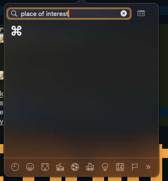

> *[[202508192241-why-i-started-quartz|Digital gardening]], because real gardening requires me to touch grass.*

> [!INFO]+ New to Zettelkasten? [[202508222156-what-is-a-zettelkasten|Click here to learn more!]]
>
> *The non-linearity of the linked notes is part of the fun! When in doubt, use the
> graph to navigate.*

## ✨ What's New?

<blockquote class="mt-16 flex gap-4">
    <em>Shiny! </em>
    

        ⌘
        G
    

    or
    

        Ctrl
        G
    

    <em>— <b>Try me!</b></em>
</blockquote>

    <a class="card wide shine" href="./perms/202508160519-mekansm.md">
        📝 On Healing
        <em class="primary">Mekansm: Practical Healing</em>
    </a>
    <a class="card wide" href="./fleets/202510062232-hg-gj:-post-post-mortem.md">
        📝 HG-GJ: Post-post-mortem
        <em class="primary">I made a game!</em>
    </a>

---

## 🗣️ Yap

I swear this page was not generated by Gippity, I just really like emojis and icon.
By the way, did you know that the Command symbol (⌘) is called [Place of Interest Sign](https://www.compart.com/en/unicode/U+2318)?

I didn't either until I tried to find it because I wanted to type it in my
Zettelkasten to explain that ⌘ ` (backtick) is,

- the reverse of ⌘ Tab when you're already in the window picker popup,
- also, it's how you can shift between multiple windows of the same app.

Pretty cool, right? Have I mentioned [[20240317140859-neovim-and-invoker|my love for keyboard shortcuts]]?

I'm not a big fan of Elon Musk, but I think he got something right when he
spoke on the bottleneck between our interaction with a PC, how it's the *input
lag between thought and keystrokes.* 

So, in my own way, I try to close that gap with keyboard shortcuts. 

Anyways, welcome!

---

## ⌘ Places of interest

<blockquote class="mt-16 flex gap-4">
    <em>Fancy another keyboard shortcut?</em>
    

        ⌘
        K
    

    or
    

        Ctrl
        K
    

    <em>— <b>Search</b></em>
</blockquote>

    <a class="card tall shine" href="./perms/202508130442-on-subjectivity.md">
        📝 On Subjectivity
        <em class="primary">Fuck it, we ball</em>
    </a>
    <a class="card tall" href="./fleets/202508270050-revisiting-how-i-do-zettelkasten.md">
        📝 Revisiting Zettelkasten
        <em class="primary">ζ</em>
    </a>
    <a class="card tall" href="./fleets/202508201549-log:-quartz.md">
        📝 Log: Quartz
        <em class="primary">Quartz activity log</em>
    </a>

<blockquote class="mt-16 flex gap-4">
    <em>Another one? </em>
    

        ⌘
        Shift
        K
    

    or
    

        Ctrl
        Shift
        K
    

    <em>— <b>Lookup tags</b></em>
</blockquote>

    <a class="card wide" href="./fleets">
        📁 Fleeting notes
        <em class="primary">They come and go, they're fleeting like that</em>
    </a>
    <a class="card wide" href="./refs">
        📁 Reference notes
        <em class="primary">References</em>
    </a>
    <a class="card wide" href="./lits">
        📁 Literature notes 
        <em class="primary">My take on other people's works</em>
    </a>
    <a class="card wide" href="./perms">
        📁 Permanent notes
        <em class="primary">I yap</em>
    </a>

---

## 🔥 Inspirations

>  *Sparks that lit the flame under my belly...*

[💚 HealthyGamerGG](https://www.youtube.com/@HealthyGamerGG) 
 
📖 Oaklander, L. Nathan. Existentialist philosophy: An introduction. Prentice Hall, 1992. 
 
[📋 josebrowne — On Coding, Ego and Attention](https://josebrowne.com/on-coding-ego-and-attention/)
 
[🌐 Quartz – Showcase](https://quartz.jzhao.xyz/showcase)
 
[📋 Quartz — A garden should be your own](https://quartz.jzhao.xyz/philosophy#a-garden-should-be-your-own)
 
[🌐 Eilleen's Everything Notebook](https://quartz.eilleeenz.com/)

---

## 🌇 On the horizon

> *Where the sparks are headed...*

💌 Love letter to ハイキュー!!
 
💬 Training my own personal, local AI on my (now 5 years) GTX 1070 Ti
 
🎓 Learn how to pull back on part-time teaching, I've been caring too much without proper compensation

